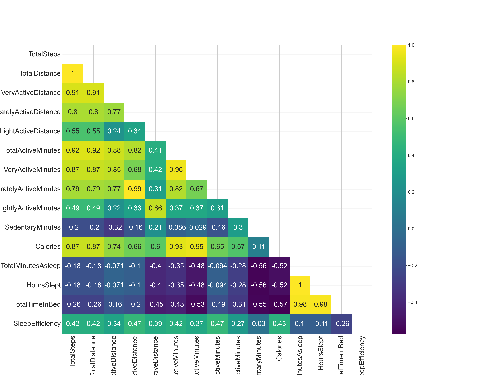
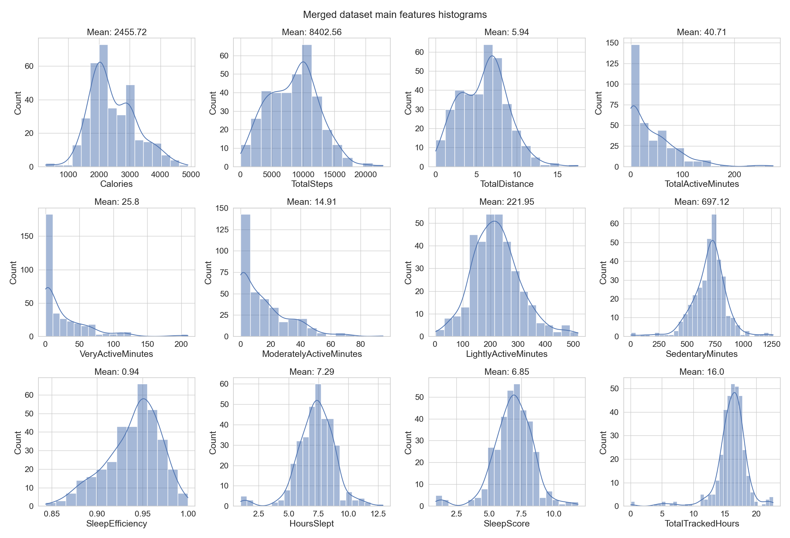
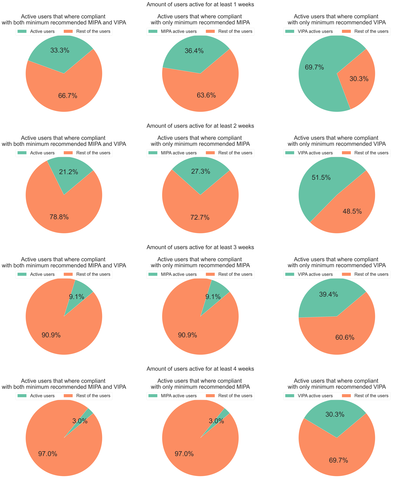
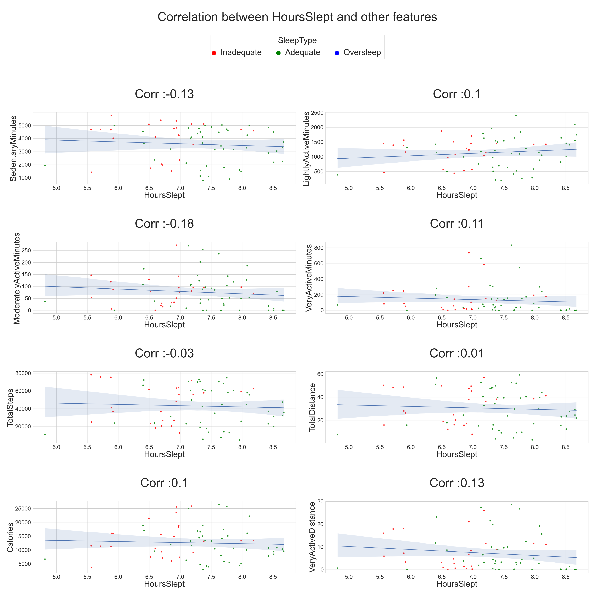
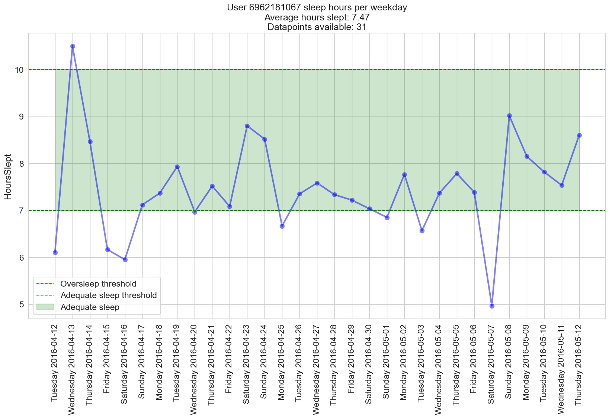

# Digital Health and Human Behavior - Course CS-C4100 Project - Aalto University

## In a nutshell


In this project the [Fitbit Fitness Tracker Datset](https://www.kaggle.com/datasets/arashnic/fitbit) has been analized in order to extract some information regarding: 
- Users compliance with [WHO guidelines on physical activity and sedentary behaviour](https://bjsm.bmj.com/content/54/24/1451)
- Relationship between exercise and sleeping according to this [work](https://www.ncbi.nlm.nih.gov/pmc/articles/PMC4341978/)
- Patterns and highlights in most/least sleepy user
- Patterns and highlights for a specific active user 

The complete project is entirely described in ```report.pdf``` 

## Code structure
    ├── dataset
    │   ├── dailyActivy_merged.csv
    │   ├── dailyCalories_merged.csv
    │   └── ...
    ├── dhbb (virtual env)
    ├── figures
    ├── papers
    ├── digital-health-project.ipynb
    ├── met.ipynb
    ├── report.pdf
    ├── readme.md
    ├── requirements.txt
    ├── logo.jpeg
    ├── figures
    │   ├── active_ratio.png
    │   └── ...
    └── README.md


## Installation and setup

### Use the current virtual env
    source dhhb/bin/activate

### Use another virtual env
1. Create a virtual env
```
python3 -m venv <env_name
```
2. Activate the virtual env
```
source <env_name>/bin/activate
```
3. Install requirements
```
pip install -r requirements.txt
```


# Introduction

In the contemporary pursuit of a health-conscious lifestyle, wearable devices have ascended to the forefront as indispensable tools, providing individuals with personalized insights and motivation to actively engage in physical activities. This assertion gains empirical support from the work of [Ringeval et al.](https://pubmed.ncbi.nlm.nih.gov/33044175/), whose exhaustive analysis of various studies reveals a demonstrable increase in walking behaviors through the seamless integration of *Fitbit* devices into daily routines. Beyond serving as mere accessories, these wearables function as constant companions, offering real-time feedback and fostering a symbiotic relationship with users, thereby substantiating the intrinsic relevance of wearable technologies in actively shaping positive lifestyle changes.

Embarking on a healthy lifestyle involves understanding individual capabilities and aligning efforts with evidence-based guidelines. The recent [report](https://bjsm.bmj.com/content/54/24/1451) by the World Health Organization (WHO) plays a pivotal role in shaping these guidelines, recommending that adults engage in 150–300 minutes of moderate-intensity or 75–150 minutes of vigorous-intensity aerobic physical activity per week, or an equivalent combination. However, the report highlighted how almost 27.5% of adults do not meet these requirements. Crucially, the intensity levels of these previous mentioned activities are standardized through the utilization of the [Metabolic Equivalent of Task (MET)](https://pubmed.ncbi.nlm.nih.gov/2204507/), a key indicator that facilitates the precise definition of exertion levels for a given physical activity.

Furthermore, the comprehensive significance of physical activity transcends mere step counts, as evidenced by [Kilic et al.'s](https://arxiv.org/abs/2303.06028) sophisticated exploration into sleep quality prediction using advanced algorithms like Random Forest and Convolutional Neural Network. However, the subsequent chapters will elucidate the intricacies and challenges posed by limitations within our dataset, particularly the uniformity and insufficiency of *Sleep Efficiency* values (an indicator defined as ratio between time asleep and time spent in bed). Taking into consideration this latest metric, it is important to mention the work of [Reed et al.](https://www.ncbi.nlm.nih.gov/pmc/articles/PMC4751425/), who discussed a potential extension of what is conventionally considered "time in bed," proposing a new type of denominator called *DSE* (duration of sleep episode). However, with the available data, it was not possible to delve into this metric.


# Results

The preliminary exploratory analysis revealed notable discrepancies in the adherence to high-intensity physical activity guidelines, particularly within the subset of users classified as "Active". **Approximately 70% of these individuals appear to fall short of meeting the World Health Organization's (WHO) prescribed standards for high-intensity physical activity, and an overwhelming 97% deviate from both WHO guidelines.** It is imperative, however, to contextualize this observation within the inherent limitations of the dataset. With a modest cohort size of 33 users and a mere one-month observational window, any definitive comparison with WHO statistics remains elusive.

The dataset's inadequacies notwithstanding, an introspective consideration emerges regarding users' self-perception of their physical activity levels. The discrepancy between subjective perceptions and objective measurements underscores the nuanced nature of physical activity, challenging preconceived notions about individuals' presumed activity levels.

Contrary to expectations and in apparent contradiction to extant literature such as the Kline's work, **the analysis failed to establish a significant correlation between sleep parameters (quality and quantity) and individuals' physical activity levels**. This unexpected result prompts scrutiny of the dataset's integrity, given its reliance on a limited subset of valid entries, with only 17 out of 33 users possessing a requisite minimum of 7 records or 31 days.

While a discernible negative correlation surfaced between physical activity and sedentary minutes, this alone does not substantiate the postulated bidirectional link between sleep and physical activity. The intricacies of these interrelationships necessitate more nuanced investigations and underscore the need for larger, more comprehensive datasets.

In further stratifying user activity, the utilization of the MET indicator dataset yielded insightful patterns, notably exemplified by **consistent morning exercise** routine and **probable sustainable commuting practices during weekdays** of user 8378563200. However, the scope of this analysis is inevitably constrained by the **limitations** inherent in the dataset, including a dearth of demographic information and a lack of granularity in the temporal dimension.

In light of these considerations, it is imperative to acknowledge the dataset's *insufficiency*, encompassing a mere 900 entries, and the considerable loss of data (almost 40%) incurred during the amalgamation of physical activity and sleep datasets. Future research endeavors should aim to access more extensive datasets featuring non-anonymized user attributes, enabling robust pattern recognition and meaningful cluster analyses. This strategic approach, incorporating variables such as age, gender, geographical location, and physiological parameters, would undoubtedly enhance the depth and relevance of subsequent investigations into the intricate interplay between sleep, physical activity, and individual characteristics. Ultimately, moving forward, there is potential for the incorporation of additional details concerning patients' sleep-related activities, including the specific timing of their sleep onset and the frequency of nocturnal awakenings.

# Some of the obtained graphs 

<center>
</center>
<center>Spearman correlation matrix between activity and sleep indicators od the
merged datase</center>
<br><br>
<center>
</center>
<center>Merged dataset features histogram</center>
<br><br>
<center>
</center>
<center>Pie charts of active users following WHO weekly requirements on physical activity considering different timespans</center>

<br><br>
<center>
</center>
<center>Correlation between Hours Slept and other activity indicators</center>
<br><br>
<center>
</center>
<center>Sleep hours per weekday for user with highest SleepScore</center>


# References

[1] Furberg, R., Brinton, J., Keating, M., & Ortiz, A. (2016). Crowd-
sourced Fitbit datasets 03.12.2016-05.12.2016 [Data set]. Zenodo.
https://doi.org/10.5281/zenodo.53894\
[2] Ringeval, M., Wagner, G., Denford, J., Par ́e, G., & Kitsiou, S. (2020). Fitbit-
based interventions for healthy lifestyle outcomes: systematic review and meta-
analysis. Journal of medical Internet research, 22(10), e23954.\
[3] Bull, F. C., Al-Ansari, S. S., Biddle, S., Borodulin, K., Buman, M. P., Cardon,
G., Carty, C., Chaput, J. P., Chastin, S., Chou, R., Dempsey, P. C., DiPietro,
L., Ekelund, U., Firth, J., Friedenreich, C. M., Garcia, L., Gichu, M., Jago, R.,
Katzmarzyk, P. T., Lambert, E., Willumsen, J. F. (2020). World Health Organi-
zation 2020 guidelines on physical activity and sedentary behaviour. British jour-
nal of sports medicine, 54(24), 1451–1462. https://doi.org/10.1136/bjsports-
2020-102955\
[4] World Health Organization. Global recommendations on physical activity for
health. Geneva: World Health Organization, 2010.\
[5] Kilic, O., Saylam, B., & Durmaz Incel, O. (2023, March). Sleep Quality Predic-
tion from Wearables using Convolution Neural Networks and Ensemble Learn-
ing. In Proceedings of the 2023 8th International Conference on Machine Learn-
ing Technologies (pp. 116-120).\
[6] NetHealth Fitbit Dataset, https://sites.nd.edu/nethealth/\
[7] Jett ́e, M., Sidney, K., & Bl ̈umchen, G. (1990). Metabolic equivalents (METS)
in exercise testing, exercise prescription, and evaluation of functional capacity.
Clinical cardiology, 13(8), 555–565. https://doi.org/10.1002/clc.4960130809
30\
[8] Semanik, P., Lee, J., Pellegrini, C. A., Song, J., Dunlop, D. D., &
Chang, R. W. (2020). Comparison of Physical Activity Measures Derived
From the Fitbit Flex and the ActiGraph GT3X+ in an Employee Popula-
tion With Chronic Knee Symptoms. ACR open rheumatology, 2(1), 48–52.
https://doi.org/10.1002/acr2.11099\
[9] Reed, D. L., & Sacco, W. P. (2016). Measuring Sleep Efficiency: What
Should the Denominator Be?. Journal of clinical sleep medicine : JCSM : of-
ficial publication of the American Academy of Sleep Medicine, 12(2), 263–266.
https://doi.org/10.5664/jcsm.5498\
[10] Kline C. E. (2014). The bidirectional relationship between exercise and sleep:
Implications for exercise adherence and sleep improvement. American journal of
lifestyle medicine, 8(6), 375–379. https://doi.org/10.1177/1559827614544437\
[11] https://www.cdc.gov/sleep/about sleep/how much sleep.html\
[12] L ́eger, D., Beck, F., Richard, J. B., Sauvet, F., & Faraut, B. (2014). The
risks of sleeping ”too much”. Survey of a National Representative Sam-
ple of 24671 adults (INPES health barometer). PloS one, 9(9), e106950.
https://doi.org/10.1371/journal.pone.0106950


